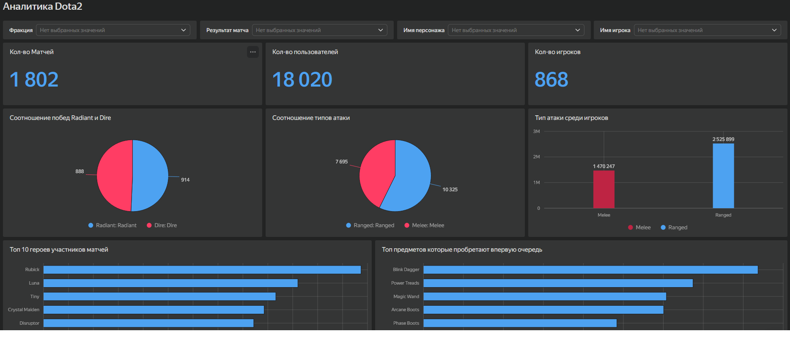

# Analiticks-Dota-2
Аналитический дашборд DOTA 2 в Yandex DataLens. 1 802 матча, 868 игроков, 8 визуализаций: победы фракций, топ героев и предметов, длительность матчей, характеристики по ролям. Портфолио-проект аналитика данных.

> 🔗 **[Посмотреть интерактивный дашборд в Yandex DataLens](https://datalens.yandex/psqoeugho8ko8?_share_link=public)**

*Скриншот главной страницы дашборда «Аналитика Dota2»*

---

## 📌 О проекте

Дашборд создан для отдела разработки игры DOTA 2. Он помогает анализировать прошедшие матчи, активность игроков и тактику команд. Инструмент позволяет отслеживать ключевые показатели в реальном времени и принимать решения по балансировке персонажей, предметов и игровых механик.

## 🎯 Цель проекта

Упростить работу разработчиков и аналитиков: предоставить единый дашборд для мониторинга общих и частных показателей матчей, чтобы делать игру зрелищнее и честнее.

## 📋 Задачи

1.  Ответить на 7 ключевых вопросов бизнеса (перечислены ниже).
2.  Добавить селекторы по полям: «Фракция», «Победитель/проигравший», «Имя персонажа», «Никнейм игрока».
3.  Настроить синхронизацию селекторов и отключить её там, где она избыточна.
4.  Оформить дашборд по правилам грамотной визуализации: единый стиль, порядок «от общего к частному», инструкция для пользователя.

## 📂 Данные

Использованы 3 CSV-файла:

| Файл | Описание |
| :--- | :--- |
| `players.csv` | Данные об игроках: kills, deaths, assists, gold_per_min, hero_id, item_0–item_5 и др. |
| `matches.csv` | Данные о матчах: duration, first_blood_time, radiant_win, region. |
| `heroes.csv` | Данные о персонажах: attack_type, primary_attr, base_health, base_attack_min/max, move_speed и др. |

> *Исходные данные не хранятся в репозитории и используются только в агрегированном виде.*

## 🛠 Инструменты

- **Визуализация:** Yandex DataLens
- **Подготовка данных:** SQL, CSV
- **Дополнительно:** DataLens Workbook, датасеты, чарты, селекторы

## 🔍 Что было сделано

- Загружены и очищены 3 CSV-файла (удалены дубликаты, убраны лишние поля).
- Создан общий датасет с соединениями по `hero_id` и `match_id`.
- Построены 8 визуализаций, отвечающих на вопросы бизнеса.
- Настроены 4 селектора с синхронизацией и без неё.
- Добавлена инструкция на дашборд (кнопка справки).
- Собран дашборд в логике «от общего к частному».

## 💡 Ключевые выводы по дашборду

- **Всего матчей:** 1 802; **уникальных игроков:** 868; **пользователей:** 18 020.
- **Победы фракций:** Radiant — 888, Dire — 914 (примерно равное соотношение).
- **Тип атаки:** Ranged (дальний бой) встречается чаще — 10 325 против 7 695 у Melee.
- **Топ-10 героев:** лидирует Rubick, за ним Luna, Tiny, Crystal Maiden, Disruptor.
- **Топ-10 первых предметов:** Blink Dagger, Power Treads, Magic Wand, Arcane Boots, Phase Boots.
- **Длительность матчей:** пик приходится на 30–40 минут; количество игроков коррелирует с длительностью.
- **Средние характеристики по ролям:** Carry имеет высокий Xp_per_min (725), Support — низкий (519); Escape лидирует по Kills_avg (9.28).

---

## 📁 Файлы проекта

- `README.md` — описание проекта
- `images/dashboard-preview.png` — скриншот дашборда

## 👤 Автор

**Казаков Александр**
- GitHub: [@CAH0](https://github.com/CAH0)
